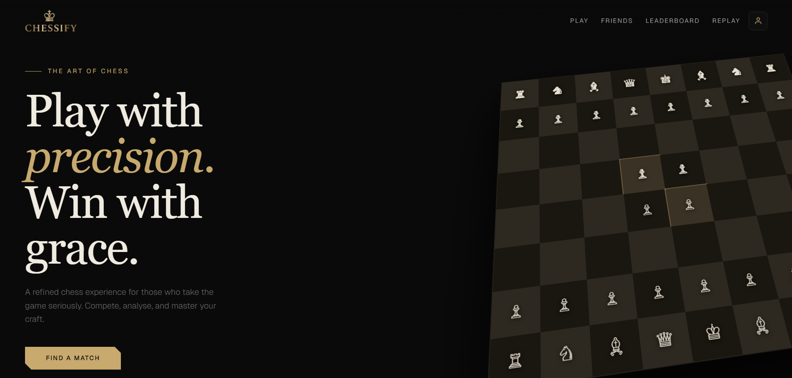
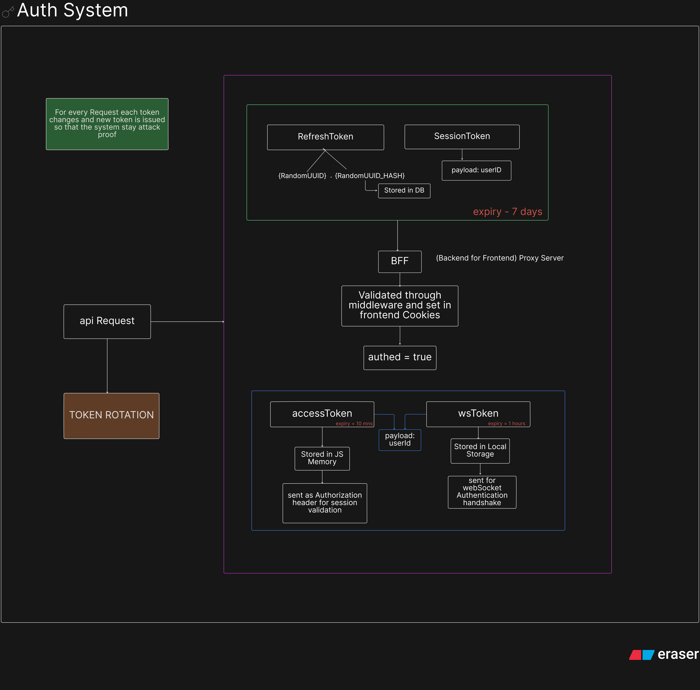
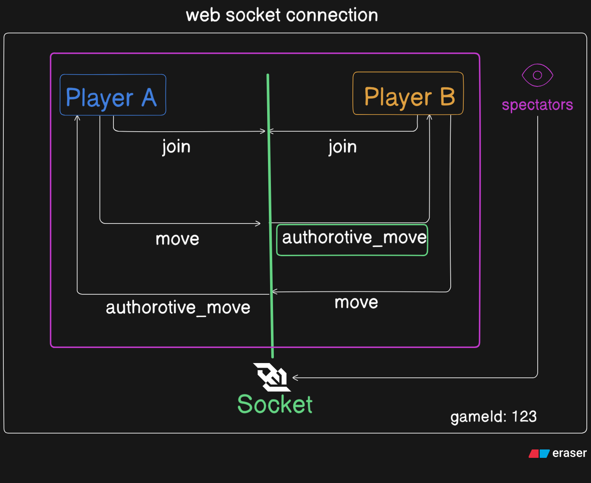
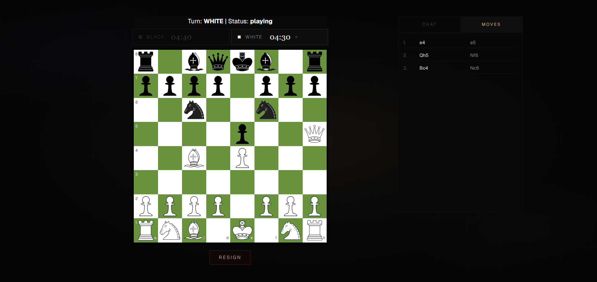
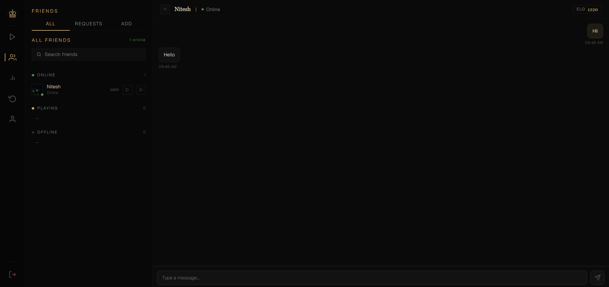
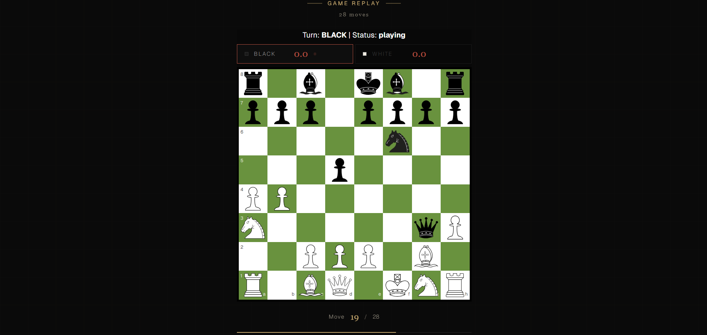
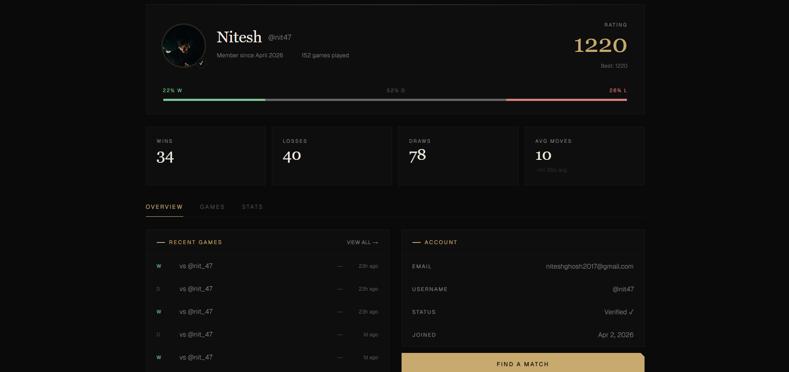

# Chessify — Frontend

A real-time multiplayer chess platform built with Next.js 15, featuring live matchmaking, friend presence, in-game chat, game replays, and a full authentication system.

---

<!-- SCREENSHOT: Landing page hero -->
> 

---

## Table of Contents

- [Features](#features)
- [Tech Stack](#tech-stack)
- [Architecture](#architecture)
- [Authentication Flow](#authentication-flow)
- [Socket Architecture](#socket-architecture)
- [Getting Started](#getting-started)
- [Environment Variables](#environment-variables)
- [Project Structure](#project-structure)
- [Deployment](#deployment)

---

## Features

- **Real-time matchmaking** — Elo-based rating queue with auto-match
- **Live presence** — See friends as online, playing, or offline in real time
- **In-game chat** — Persistent game chat with unread notification badge
- **Friend system** — Add, invite, unfriend, and message friends
- **Game replay** — Step through any past game move by move
- **Rematch flow** — Request and accept rematches with countdown timer
- **Abandonment detection** — Auto-win if opponent disconnects for 30+ seconds
- **Pawn promotion** — Interactive promotion dialog mid-game
- **Spectator mode** — Watch live games in real time
- **Forgot password** — OTP-based 3-step password reset flow
- **Google OAuth** — Full-page redirect OAuth with BFF cookie handling
- **Route protection** — Middleware-based auth with JWT verification

---

## Tech Stack

| Layer | Technology |
|---|---|
| Framework | Next.js 16 (App Router) |
| Language | TypeScript |
| Styling | Tailwind CSS |
| State | Zustand |
| Real-time | Socket.io Client |
| HTTP | Axios |
| Auth | JWT + httpOnly cookies via BFF proxy |
| UI | Shadcn/ui (selective) |

---

## Architecture

<!-- ARCHITECTURE DIAGRAM: Add your Eraser.io full architecture diagram here -->
> 
[View Full Architecture on Eraser.io](https://app.eraser.io/workspace/YLQYjAGwqekeW8xuezXB)

---

## Authentication Flow

Chessify uses a **4-token system** to handle auth securely across cross-domain deployments:

| Token | Storage | Purpose | Expiry |
|---|---|---|---|
| `accessToken` | JS Memory | API request Authorization header | 10 min |
| `refreshToken` | httpOnly Cookie (via BFF) | Rotate access tokens | 7 days |
| `sessionToken` | httpOnly Cookie (via BFF) | Middleware route protection | 7 days |
| `wsToken` | localStorage | WebSocket handshake auth | 1 hours |

### BFF Proxy Pattern

Since the frontend (Vercel) and backend (Render) are on different domains, cookies set by the backend are blocked by the browser. All auth requests are proxied through Next.js API routes which set cookies on the same domain as the frontend.

```
Browser → Next.js API Route (/api/auth/*) → NestJS Backend
                ↓
        Sets httpOnly cookies on vercel.app domain
```

<!-- ARCHITECTURE DIAGRAM: Auth system flow -->
> 

### Token Rotation

Every request rotates the refresh token — the old token is invalidated and a new one is issued. This prevents token reuse attacks.

---

## Socket Architecture

Three dedicated Socket.io namespaces run on a single backend port:

```
Frontend Sockets          Backend Namespaces
─────────────────         ──────────────────
presenceSocket.ts    →    /presence   (online/offline tracking)
socket.ts            →    /           (game moves, matchmaking)
chatSocket.ts        →    /chat       (DMs, game chat)
```

### Presence System

- Socket room membership (`user:${userId}`) is the **single source of truth** for online/offline status — not Redis
- 5-second disconnect debounce with cancellable timers prevents false offline events during page navigation
- Friends list is fetched entirely via socket (`get_friends_with_presence`) — no REST race conditions

<!-- ARCHITECTURE DIAGRAM: Socket namespace diagram -->
> 

---

## Getting Started

### Prerequisites

- Node.js 18+
- npm or yarn

### Installation

```bash
git clone https://github.com/NiteshCodes7/chessify-frontend
cd chessify-frontend
npm install
```

### Development

```bash
npm run dev
```

Open [http://localhost:3000](http://localhost:3000)

---

## Environment Variables

Create a `.env.local` file:

```env
NEXT_PUBLIC_API_URL=http://localhost:3001
JWT_ACCESS_SECRET=your-jwt-secret-same-as-backend
```

> `JWT_ACCESS_SECRET` is used by Next.js middleware (proxy) to verify `sessionToken` locally without a database call.

---

## Project Structure

```
src/
├── app/
│   ├── (authenticated)/        # Protected pages (play, game, friends, profile)
│   │   ├── play/
│   │   ├── game/[gameId]/
│   │   ├── friends/
│   │   └── replay/[gameId]/
│   ├── auth/                   # Public auth pages
│   │   ├── login/
│   │   ├── register/
│   │   ├── verify-otp/
│   │   └── forgot-password/
│   ├── api/auth/               # BFF proxy routes
│   │   ├── login/
│   │   ├── refresh/
│   │   ├── logout/
│   │   └── google/set-session/
│   └── components/
│       ├── chess/              # ChessBoard, ChessClock, PromotionDialog
│       ├── chat/               # ChatWindow, ChatInput, MessageItem, GameChatPanel
│       └── friends/            # FriendsSidebar, FriendItem, FriendRequests, AddFriend
├── context/
│   └── AuthProvider.tsx        # Auth state, socket connection, presence listeners
├── lib/
│   ├── api.ts                  # Axios instance with interceptors
│   ├── socket.ts               # Game socket singleton
│   ├── presenceSocket.ts       # Presence socket singleton
│   ├── chatSocket.ts           # Chat socket singleton
│   └── socketManager.ts        # Connect/disconnect all sockets
├── store/
│   ├── useGameStore.ts         # Chess game state (Zustand)
│   ├── useToast.ts             # Toast notifications
│   └── useInviteStore.ts       # Friend invite state
└── proxy.ts               # Route protection via JWT verification
```

---

## Key Implementation Details

### Chess Board
- Server-authoritative moves — client sends intent, server validates and broadcasts
- Legal move highlighting with castling, en passant, and promotion detection
- Responsive board using CSS Grid with `min(80vw, 504px)` sizing

### Game State
- Zustand store holds board, turn, clocks, selected piece, and legal moves
- `applyRemoteMove` applies opponent moves without re-validation
- Clock runs client-side interpolated from server timestamps

### Presence
- `livePresence` ref buffers socket updates that arrive before the friends list loads
- `pendingUpdates` map ensures no presence events are lost during initial fetch

---

## Deployment

Deployed on **Vercel** with automatic GitHub deployments.

```bash
# Production build
npm run build

# Environment variables required on Vercel:
# NEXT_PUBLIC_API_URL
# JWT_ACCESS_SECRET
```

See [deployment guide](#) for full setup including BFF proxy configuration.

---

## Screenshots

<!-- Add screenshots below -->

| Page | Screenshot |
|---|---|
| Landing |  |
| Game |  |
| Friends |  |
| Replay |  |
| Profile |  |

---

## Related

- [Chessify Backend](../backend/README.md)